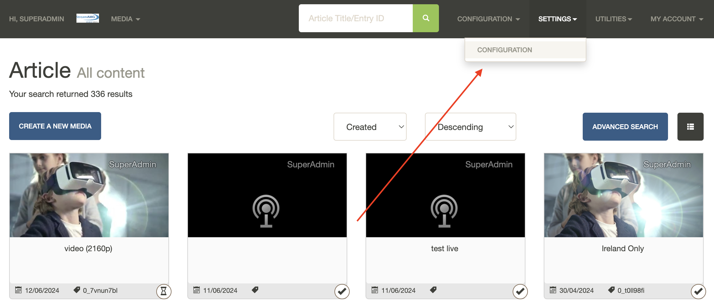
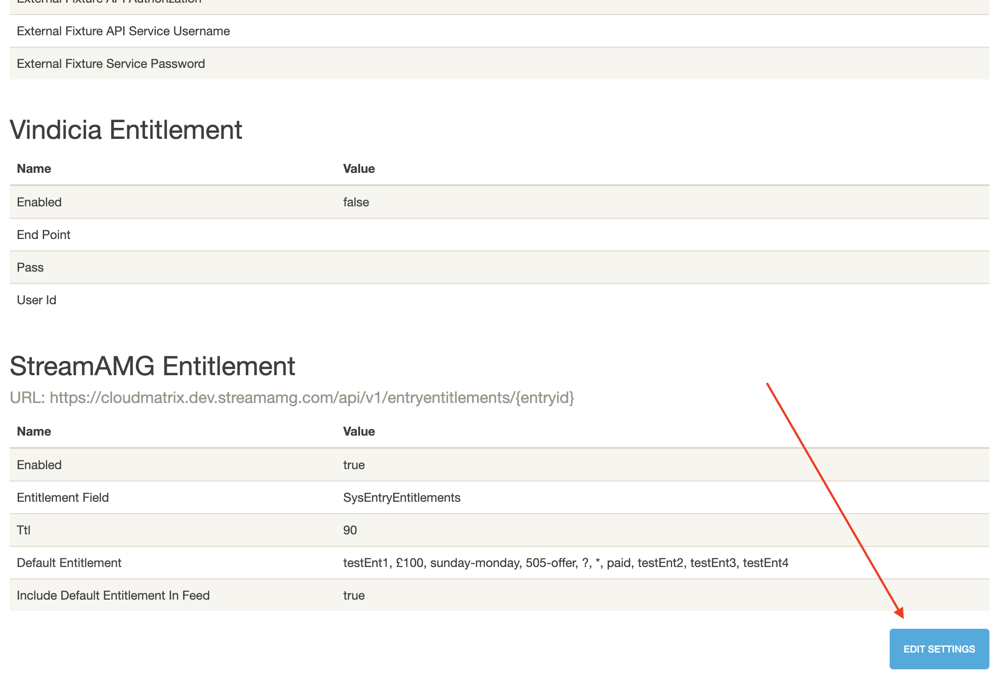
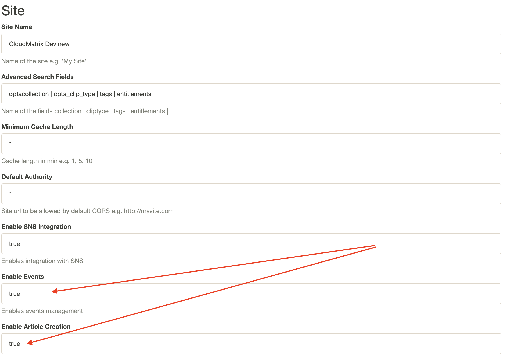
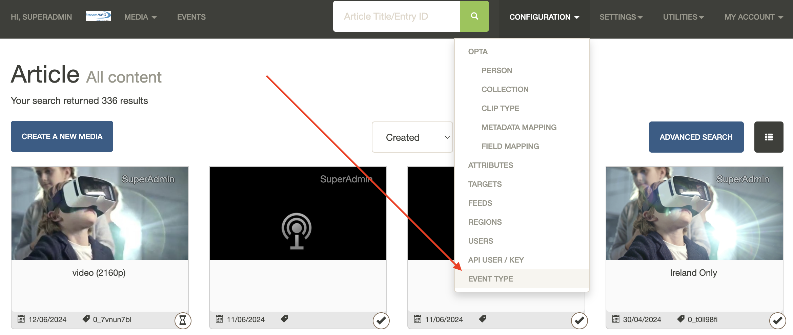
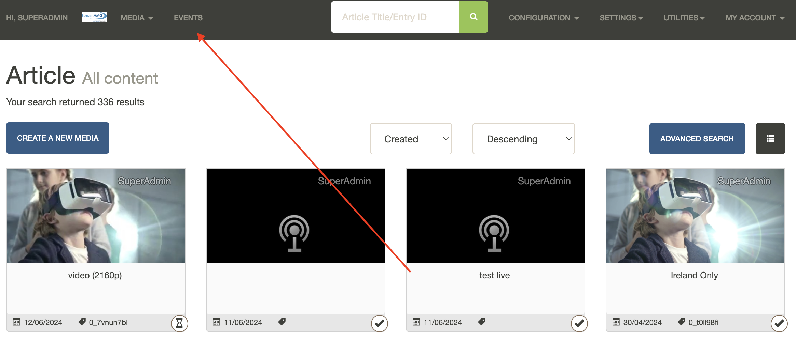
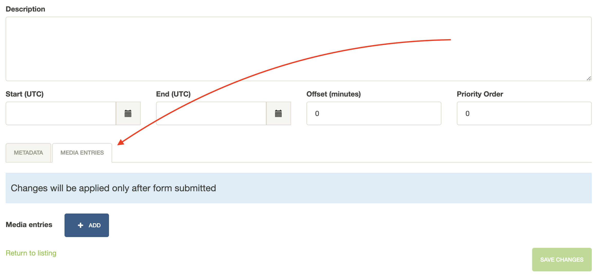

# Events

CloudMatrix Events functionality allows you to create an event entity and assign it multiple videos, live streams, or audio streams. The returned events are determined based on the parameters provided at the time of the request. By default, the endpoint only returns events that are currently active or upcoming. Our endpoint will expose high-throughput read endpoints to allow easy consumption of the events by the integrations/websites.

For example, there is a tennis championship next week with five courts and overlapping games. With this functionality, it is possible to create an event within CloudMatrix, then create live stream entities for each court and return all of them via Events API. This way, it is possible to allow the user watching the championship to switch courts and watch the game they are interested in.

## Prerequisites

- CloudMatrix instance is set up

## The Event Creation Process

### 1. Enable Events functionality for your CloudMatrix Instance

Navigate to CloudMatrix Configuration settings.

Click **Edit Settings** button at the bottom of the page.

Enable Events and Article creation functionality.

Click **Save Changes** button at the bottom of the page.

### 2. Upload your content to CloudMatrix

This step is outlined in the following guides:

- [Upload a Media Entry](./Upload%20a%20media%20entry.md)
- [XML Enrichment Upload](./XML-enrichment-upload.md)

### 3. Create an event type

Navigate to the event type creation page.

Click the **Create New** button at the bottom of the page, fill in the form and save the changes.

### 4. Create an event

Navigate to the events page.

Click the **Create New Event** button at the top of the page. Then, choose the newly created type from the dropdown, fill in the form, and save the changes.

**Note:** content can be added to the event via the **Media Entries** tab.

## Accessing the Events API

### 1. Create an API user

Navigate to the **Configuration** -> **API User / Key** page, click the **Create New API User** button, fill in the form, and save changes.

### 2. Make API calls according to the Events API reference

- [List available events](https://streamamg.stoplight.io/docs/cloudmatrix-documentation-portal/pe03y4h6vqo9r-list-available-events)
- [Get a single event by ID](https://streamamg.stoplight.io/docs/cloudmatrix-documentation-portal/z4rk59ri6btib-get-a-single-event-by-id)

## Georestrictions

It is possible to restrict certain content in the event (which is returned in the **itemData** property from the API) from being accessed by users from specific locations. For that, an API User must have a **Target ID** with a specific location assigned to it. **Target ID** can be created by navigating to **Configuration** -> **Targets** page and then assigned to an API User in **Configuration** -> **API User / Key** page.

In Events API endpoints, **targetID** path parameter can be supplied and it must be assigned to the API User accessing the API. However, this path parameter is not required and can be omitted. In this case, default unrestricted **targetId** must be assigned to the API User.
