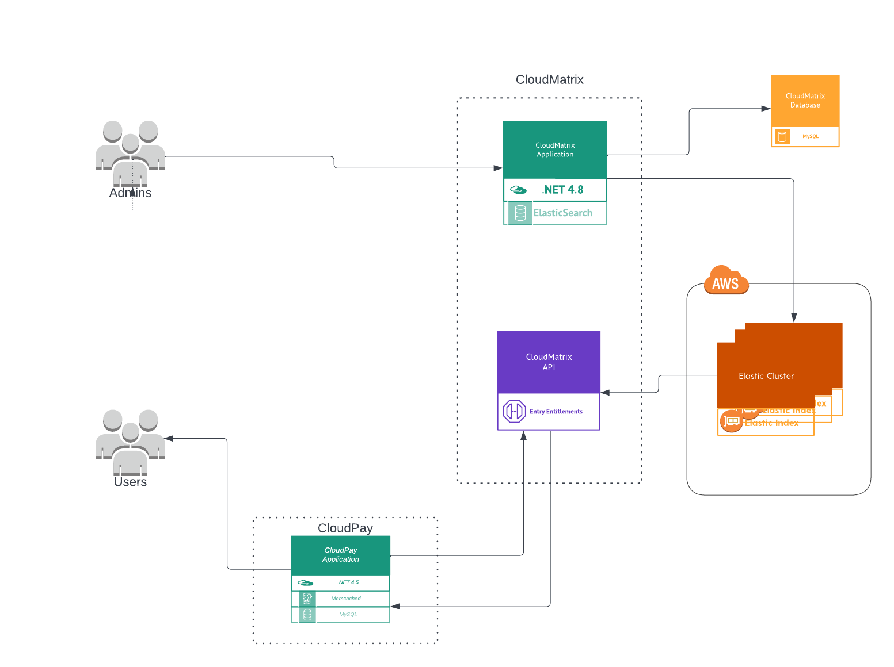

# Get Entry Entitlement

Entry entitlement API is used to get the list of entry entitlement for a given entry. The entitlement to entry is assigned to by the admin and is used to validate if user has valid entitlement to watch the media. 

The high level flow diagram:

