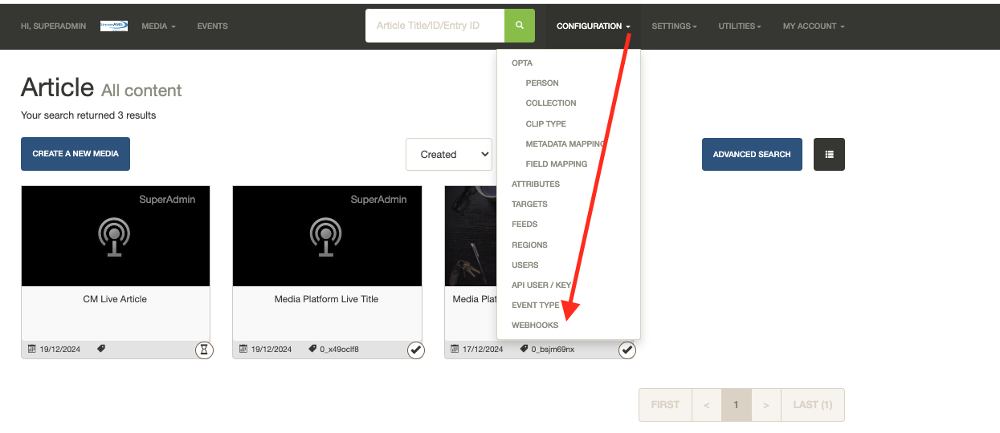
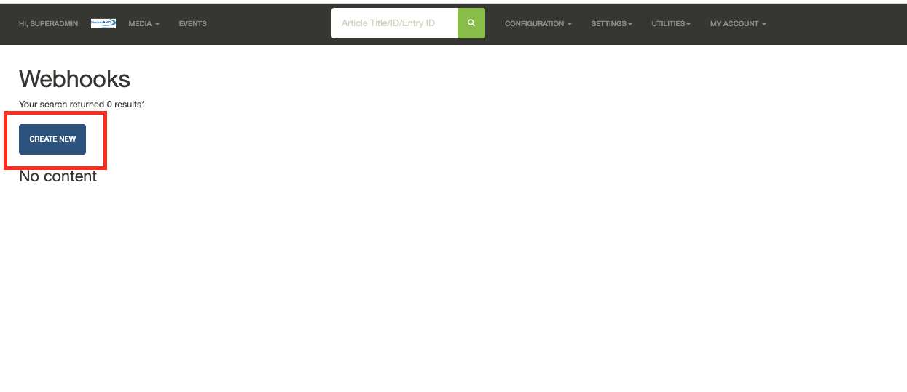
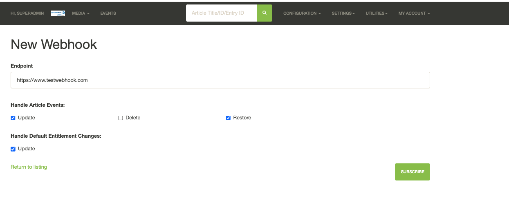
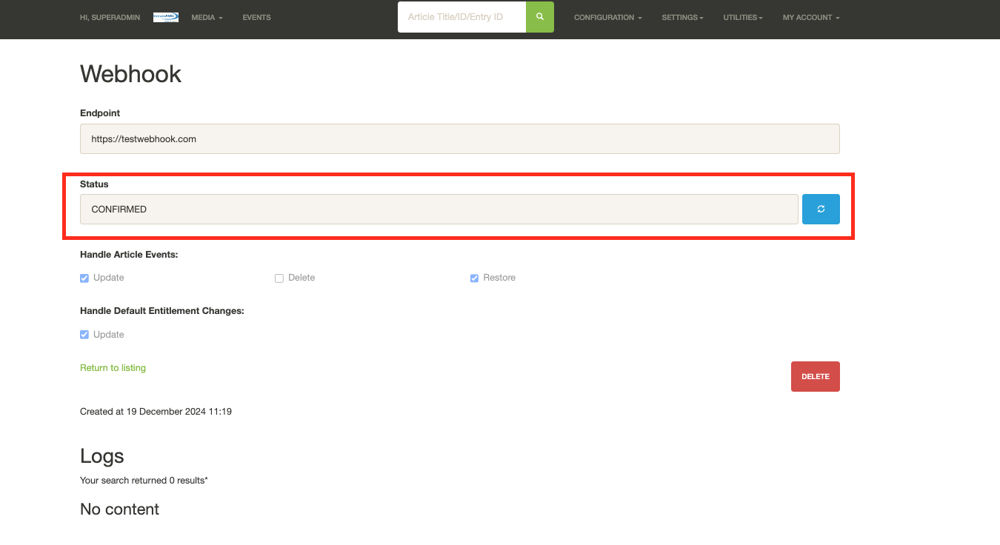
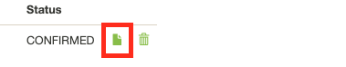
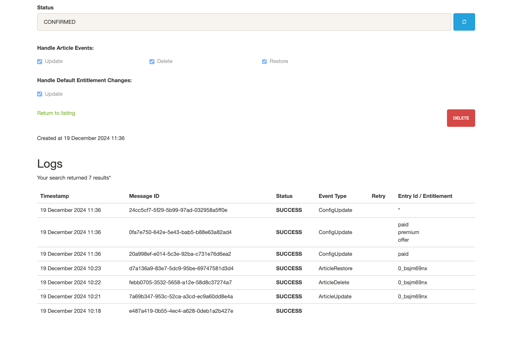

# Webhooks

CloudMatrix Webhooks functionality allows you to create a webhook to receive any of four types of events within the CloudMatrix system. These four event types are:

- **article.update**  
- **article.delete**  
- **article.restore**  
- **config.update**

## Prerequisites

- A CloudMatrix instance is set up.  
- SNS Datastore functionality is enabled for the instance.  
- A webhook to receive the event type(s).  

## Event Types

Below is a brief outline of the event types. You do not have to configure all types; you can select one, several, or all per webhook.

### article.update

Whenever an article is edited or content is uploaded to CloudMatrix via MediaPlatform or Enrichment Service, an event will be sent to the webhook. This includes changes made through an input box or anything specific to the publication schedule. It does not include deletion or restoration.

### article.delete

Whenever an article is deleted, an event will be sent to the webhook.

### article.restore

Whenever an article is restored from deletion, an event will be sent to the webhook.

### config.update

Whenever the default entitlement is changed in `Settings > Configuration` under the `StreamAMG Entitlement` section, an event will be sent to inform you of the updated default entitlement.

## The Webhook Creation Process

### 1. Set Up a Webhook Subscription

When logged into CloudMatrix, click the **CONFIGURATION** drop-down and select **WEBHOOKS**.



### 2. Click Create New

On the Webhooks page, click the **Create New** button.



### 3. Set Up Webhook

On the **New Webhook** screen, you will need to set:

- The endpoint for the webhook.  
- Any article event type(s).  
- Default entitlement change.  



Then, click **Subscribe**.

### 4. Subscription Confirmation

Once a webhook is added, AWS SNS will send out a confirmation request to the webhook to be acknowledged. If the webhook is confirmed within 48 hours, you will see the following status:



If the webhook takes a while to respond or fails to respond to the message within 48 hours, the following statuses will occur:

- **PENDING**  
- **FAILED**  

If this happens, you can click on the blue refresh button to check the AWS SNS subscription status.

#### Auto Deletion

The webhook will self-delete after 48 hours, as this is how AWS SNS handles unconfirmed webhooks.

## Webhook Logs
Once you have a subscribed webhook, you can access the logs by doing the following:

### 1. Click the File Icon


Here you can then view the event types


 <b>Note</b>: Logs are kept for 7 days.

## Webhook Message Data

The following are examples of the data expected to be sent in the message portion of the webhook:

### Article Example - On Demand
```json
{
  "id": "e33cf999-395f-45c1-b682-76b834a604f0",
  "timestamp": "2024-12-19T09:36:54.5601363Z",
  "payload": {
    "mediaData": {
      "mediaType": "OnDemand",
      "mediaReady": true
    },
    "metadata": {
      "title": "Media Platform OnDemand Title",
      "body": "Media Platform OnDemand Body",
      "tags": "",
      "duration": 15,
      "sysEntryEntitlements": [
        "*"
      ],
      "defaultEntitlementApplied": true
    }
  }
```

### Article Example - Live
```json
{
  "id": "6a594eec-7ebe-4c5a-9376-33d5fc46c9fa",
  "timestamp": "2024-12-19T09:36:38.7614609Z",
  "payload": {
    "mediaData": {
      "mediaType": "Live",
      "mediaReady": true
    },
    "metadata": {
      "title": "CM Live Article",
      "body": "CM Live Body",
      "tags": "",
      "duration": "",
      "sysEntryEntitlements": [
        "*"
      ],
      "defaultEntitlementApplied": true
    }
  }
}
```

### CloudMatrix Default Entitlements

#### Single Entitlement
```json
{
  "payload": {
    "defaultEntitlement": [
      "*"
    ]
  },
  "eventId": "f36215df-9efa-4766-b1a5-f63584509661",
  "timestamp": "2024-12-19T11:36:43.8899765Z"
}
```

#### Multiple Entitlement
```json
{
  "payload": {
    "defaultEntitlement": [
      "paid",
      "premium",
      "offer"
    ]
  },
  "eventId": "ff76b50d-fd2d-45d9-bfb4-c1f6c56f8abe",
  "timestamp": "2024-12-19T11:36:38.4911556Z"
}
```
